Tour Guide: Islamabad
===================================
Apk Link : https://drive.google.com/file/d/1hhdeFdWs1nkNKI7hD3DXjMm_sJneYoyk/view?usp=sharing

This app contains the information about Islamabad different places and it is created mainly for any tourist who wants to 
visit the Islamabad City of Pakistan.

Getting Started
---------------

This sample uses the Gradle build system. To build this project, use the
"gradlew build" command or use "Import Project" in Android Studio.

This project was created by IRFAN GujjAR as part of the Android Basics Nanodegree (Free Program) At Udacity.

As part of Udacity Honor code, your submissions must be your own work, hence
submitting this project as yours will cause you to break the Udacity Honor Code
and the suspension of your account.

Me, the author of the project, allow you to check the code as a reference, but if
you submit it, it's your own responsibility if you get expelled.

License
-------
Copyright (c) 2019 IRFAN GujjAR

http://www.apache.org/licenses/LICENSE-2.0

Besides the above notice, the following license applies and this license notice
must be included in all works derived from this project.

Permission is hereby granted, free of charge, to any person obtaining a copy
of this software and associated documentation files (the "Software"), to deal
in the Software without restriction, including without limitation the rights
to use, copy, modify, merge, publish, distribute, sublicense, and/or sell
copies of the Software, and to permit persons to whom the Software is
furnished to do so, subject to the following conditions:

The above copyright notice and this permission notice shall be included in all
copies or substantial portions of the Software.

THE SOFTWARE IS PROVIDED "AS IS", WITHOUT WARRANTY OF ANY KIND, EXPRESS OR
IMPLIED, INCLUDING BUT NOT LIMITED TO THE WARRANTIES OF MERCHANTABILITY,
FITNESS FOR A PARTICULAR PURPOSE AND NONINFRINGEMENT. IN NO EVENT SHALL THE
AUTHORS OR COPYRIGHT HOLDERS BE LIABLE FOR ANY CLAIM, DAMAGES OR OTHER
LIABILITY, WHETHER IN AN ACTION OF CONTRACT, TORT OR OTHERWISE, ARISING FROM,
OUT OF OR IN CONNECTION WITH THE SOFTWARE OR THE USE OR OTHER DEALINGS IN THE
SOFTWARE.

                                                  App Images
                                              =================
                                            
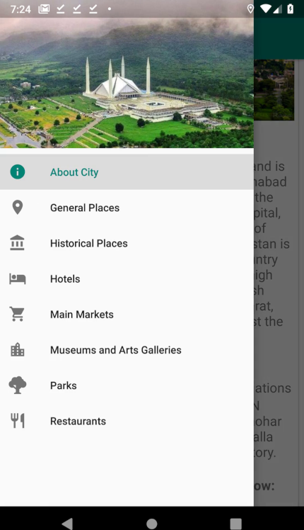 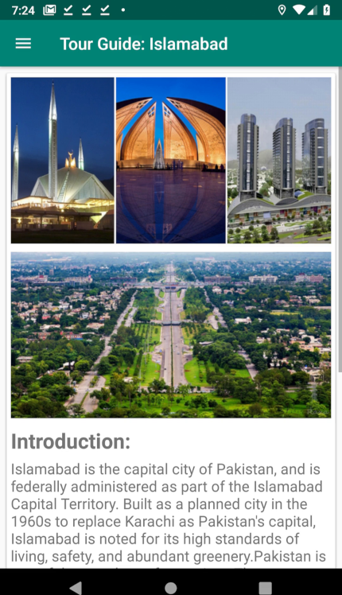

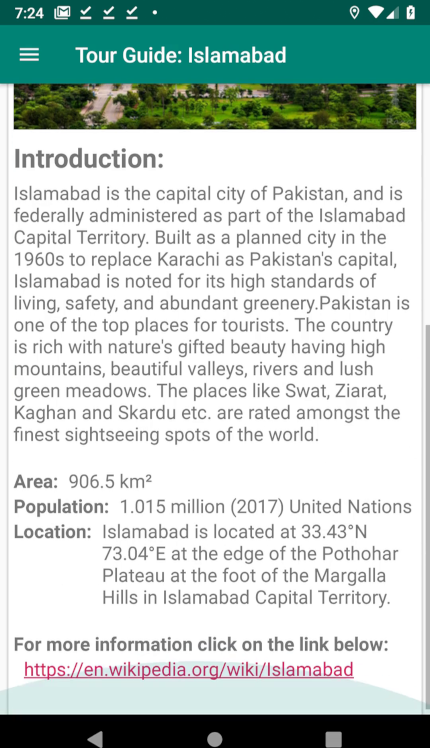 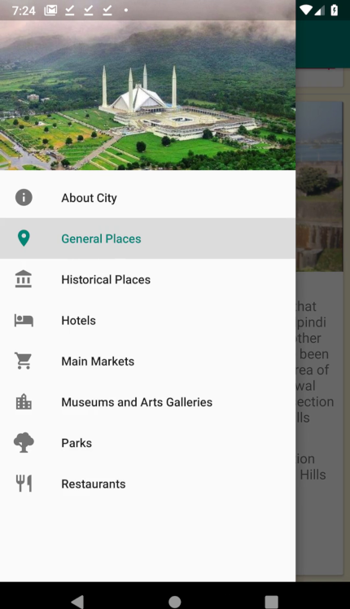

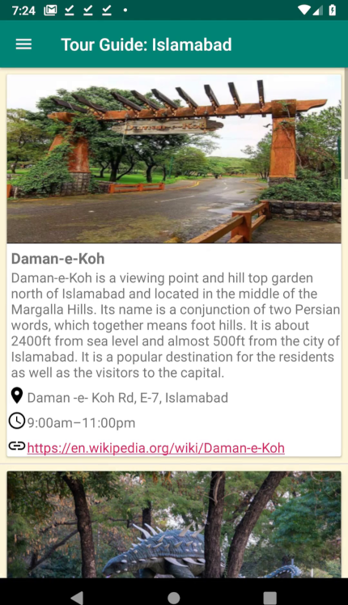 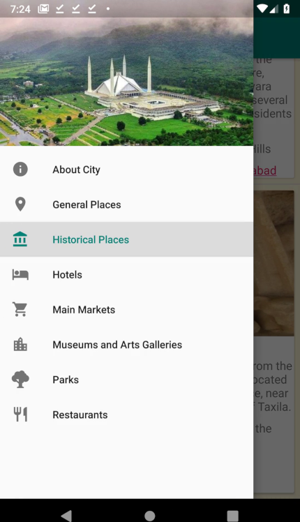

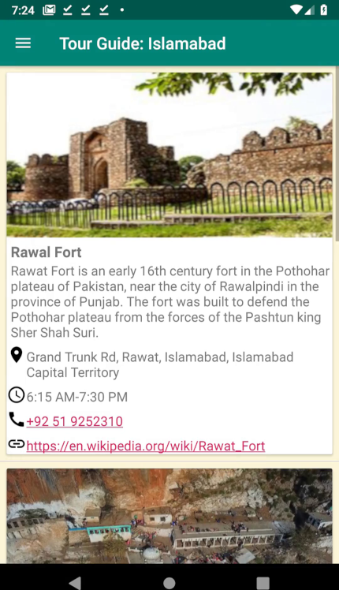 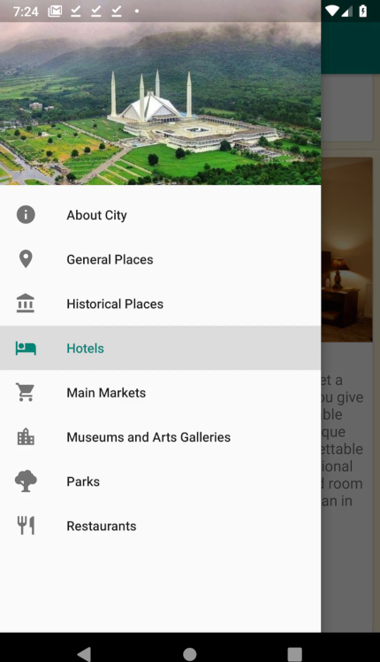

 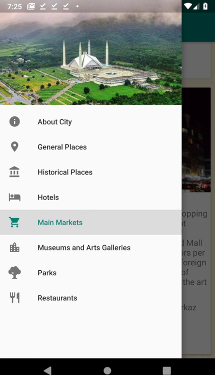

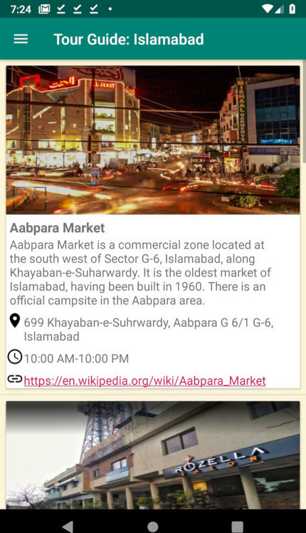 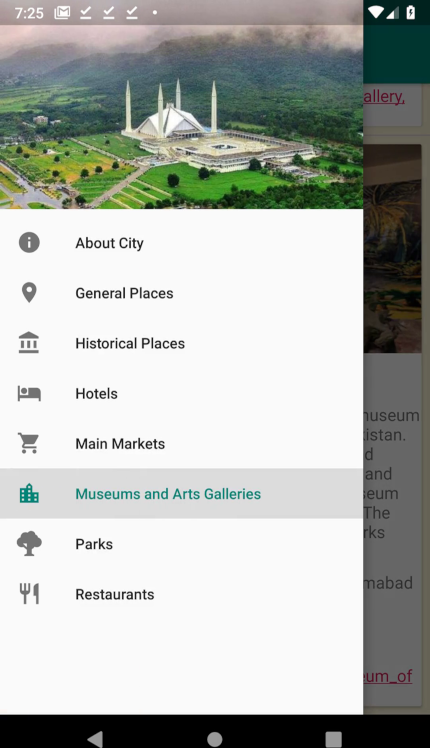

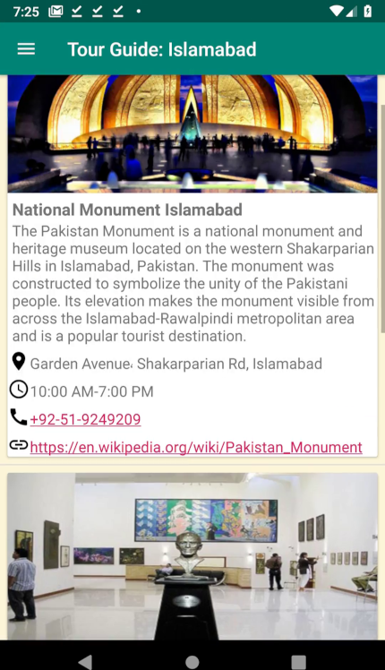 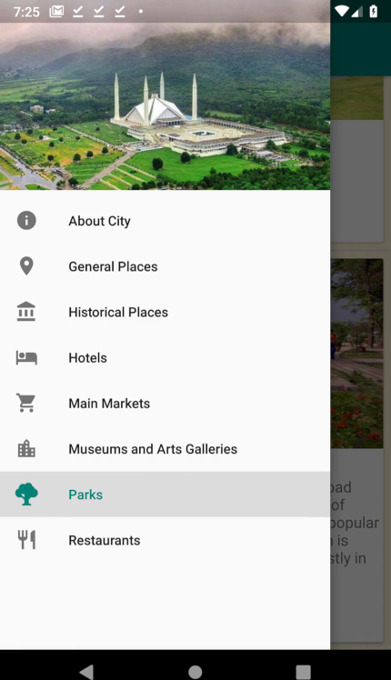

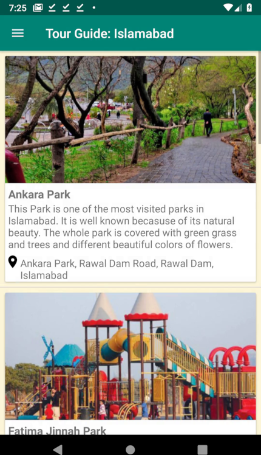 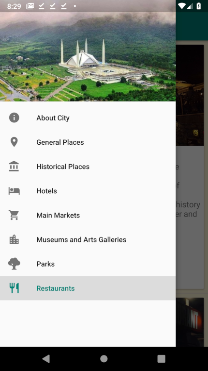

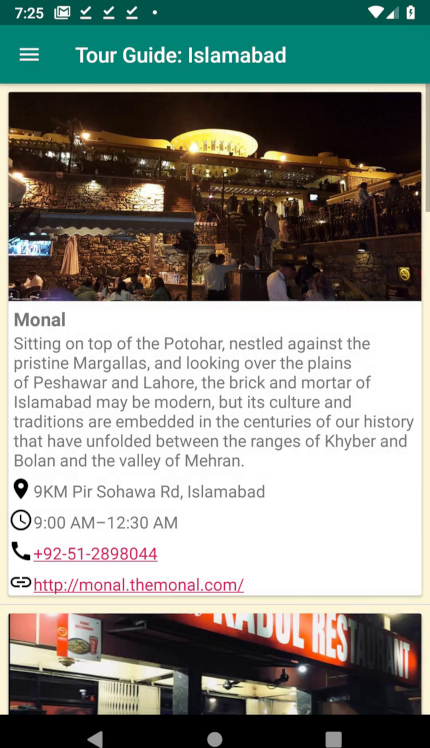 
